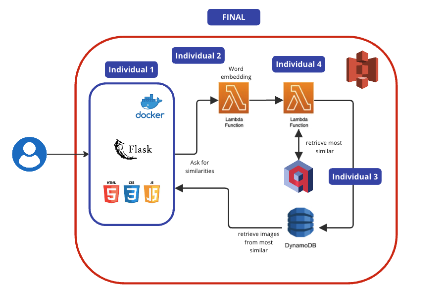
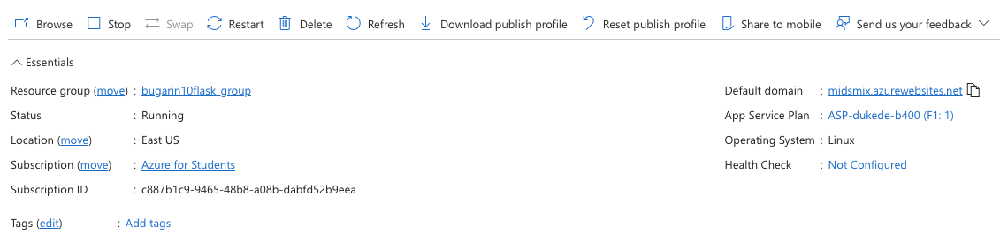

# Mix and Cocktail recommendation Engine 🍷🍸🍹

# Motivation

Our moto is the impact we can make in alleviating choice overload. This phenomenon, characterized by the overwhelming stress and indecision caused by an abundance of options, is a challenge many face daily. By developing a recommendation engine, we aim to empower individuals with personalized suggestions, reducing the cognitive load associated with decision-making and increasing satisfaction with chosen options. Let's drink and think in the conversation not on what to drink!

# Project Structure

This is the broad structure of the project and how we visualize is going to be merging all projects:

# Deployment

For this individual one the project was deployed on Azure because doing it on AWS has not being explored yet, the website was https://midsmix.azurewebsites.net/ but it will be up just for the demo.

